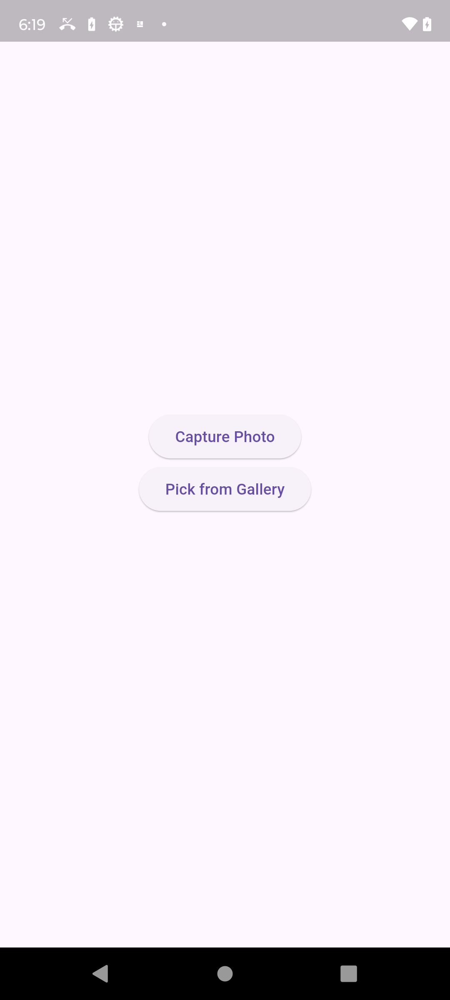

# 📸 camerapack

`camerapack` is a Flutter plugin that opens a **native camera screen** (iOS and Android), captures a photo using the **front or back camera**, and returns the **image file path** to Flutter. It also supports picking an image from the **gallery**.

---



---

## 🚀 Features

- 📷 Launch a native camera screen (Android & iOS)

- 🔄 Switch between front and back cameras

- ⚡ Toggle flash (iOS)

- 🔁 Handles device orientation changes

- 📁 Capture and return image file path to Flutter

- 🖼 Pick images directly from the gallery

- 🧭 Full-screen custom camera UI

- 🔌 Communication handled via Flutter platform channels

---

## 📱 Platform Support

| Platform | Support |
|----------|---------|
| Android  | ✅       |
| iOS      | ✅       |

---

## 🔧 Installation

Add the plugin to your `pubspec.yaml`:

```yaml
dependencies:
  camerapack: ^0.0.7
```

Then run:

```bash
flutter pub get
```

---

## 🛠 Usage

Import the package:

```dart
import 'package:camerapack/camerapack.dart';
```

### 📷 Capture an Image

```dart
final camerapack = Camerapack();

String? imagePath = await camerapack.captureImage();
if (imagePath != null) {
  // Use the image path (e.g., display or upload)
}
```

### 🖼 Pick an Image from Gallery

```dart
String? imagePath = await camerapack.pickFromGallery();
if (imagePath != null) {
  // Use the image path
}
```

---

## 🧪 Full Flutter Example

```dart
import 'dart:io';

import 'package:flutter/material.dart';
import 'package:flutter/services.dart';
import 'package:camerapack/camerapack.dart';

void main() {
  runApp(const MyApp());
}

class MyApp extends StatefulWidget {
  const MyApp({super.key});

  @override
  State<MyApp> createState() => _MyAppState();
}

class _MyAppState extends State<MyApp> {
  String? imagePath;
  final _camerapack = Camerapack();

  Future<void> _capturePhoto() async {
    try {
      final path = await _camerapack.captureImage(isfront: true);
      if (mounted && path != null) {
        setState(() {
          imagePath = path;
        });
      }
    } on PlatformException catch (e) {
      debugPrint('Failed to capture image: $e');
    }
  }

  Future<void> _pickFromGallery() async {
    try {
      final path = await _camerapack.pickFromGallery();
      if (!mounted) return;
      if (path != null) {
        setState(() => imagePath = path);
      }
    } on PlatformException catch (e) {
      debugPrint('Error picking image: $e');
    }
  }

  @override
  Widget build(BuildContext context) {
    return MaterialApp(
      debugShowCheckedModeBanner: false,
      home: Scaffold(
        body: Center(
          child: Padding(
            padding: const EdgeInsets.all(24.0),
            child: Column(
              mainAxisAlignment: MainAxisAlignment.center,
              children: [
                TextButton(
                  onPressed: _capturePhoto,
                  child: const Text('📸 Capture Photo'),
                ),
                const SizedBox(height: 20),
                ElevatedButton(
                  onPressed: _pickFromGallery,
                  child: const Text('🖼 Pick from Gallery'),
                ),
                const SizedBox(height: 30),
                if (imagePath != null)
                  Image.file(
                    File(imagePath!),
                    width: 200,
                    height: 200,
                    fit: BoxFit.cover,
                  )
              ],
            ),
          ),
        ),
      ),
    );
  }
}
```

This will:

- Launch the native camera screen (front camera)
- Capture a photo
- Return the file path
- Display the captured image in the app

---

## 📂 iOS Configuration

To access the camera and photo library on iOS, add the following permissions to your `ios/Runner/Info.plist`:

```xml
<key>NSCameraUsageDescription</key>
<string>We need camera access to take photos</string>
<key>NSPhotoLibraryUsageDescription</key>
<string>We need access to your photo library</string>
```

> 💡 These keys provide user-facing explanations for why your app needs access. Make sure the descriptions match your app’s functionality.

---

## 📂 Android Configuration

Make sure you have these permissions in your `android/app/src/main/AndroidManifest.xml`:

```xml
<uses-permission android:name="android.permission.CAMERA"/>
<uses-permission android:name="android.permission.READ_EXTERNAL_STORAGE"/>
<uses-permission android:name="android.permission.WRITE_EXTERNAL_STORAGE"/>
```

Also, ensure your `minSdkVersion` is at least `21` in `android/app/build.gradle`:

```gradle
defaultConfig {
    minSdkVersion 21
}
```

---

## 🧑‍💻 Contributing

Pull requests are welcome.  
For major changes, please open an issue first to discuss what you’d like to change.

---

## 📄 License

This plugin is licensed under the [Apache 2.0 License](LICENSE).
